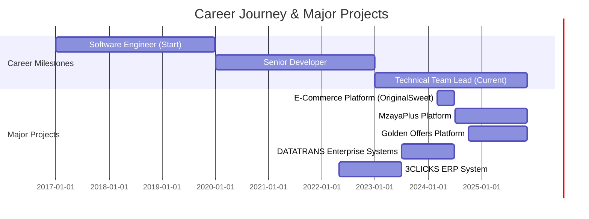
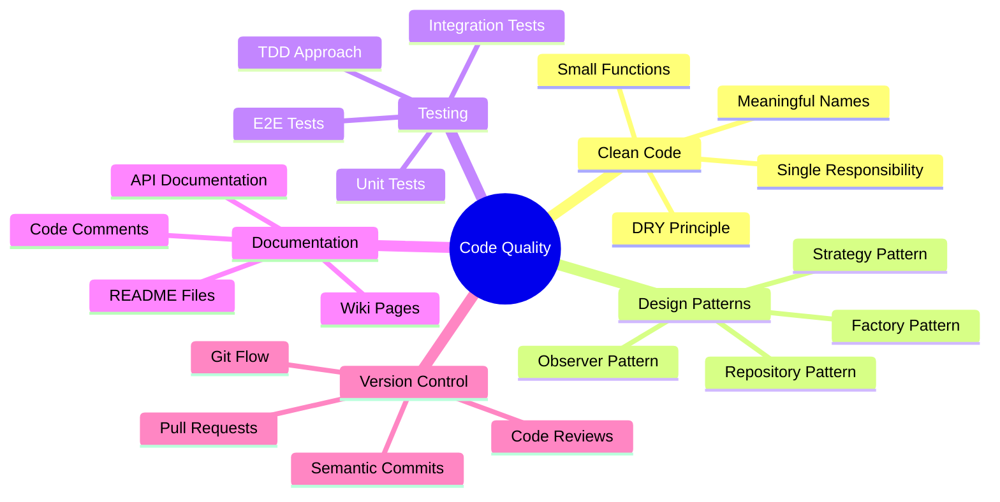

<div align="center">

# 👨‍💻 ALI WOSABY


<p align="center">
  <a href="https://www.linkedin.com/in/ali-wosaby-2bbb03181/"></a>
  <a href="mailto:programmeurweb.a@gmail.com"></a>
  <a href="https://wa.me/966542327104"></a>
  <a href="https://github.com/ALIWOSABY"></a>
</p>

<p align="center">
  
  
  
  
</p>

</div>

---

## 🎯 About Me

```yaml
name: Ali Wosaby
role: Senior Full-Stack Software Engineer & Technical Team Lead
location: Riyadh, Saudi Arabia
experience: 7+ Years
education: Master's in Software Engineering for the Cloud
specialization: 
  - Enterprise Web Applications
  - E-Commerce Solutions
  - ERP Systems Architecture
core_expertise:
  backend: [Laravel, PHP, ASP.NET Core, Java Spring Boot]
  frontend: [Vue.js, React, Angular, JavaScript/TypeScript]
  mobile: [Flutter, Android Native]
  leadership: [Team Management, Agile/Scrum, Code Review]
current_focus: Building Scalable Cloud-Native Applications
projects_delivered: 26+ Production Systems
team_size_managed: 5-10 Developers
```

<details>
<summary>📊 <b>Career Highlights</b></summary>
<br/>

- 🏆 **Led development teams** across multiple international companies
- 🚀 **Architected and deployed** 26+ production-grade systems
- 💰 **Built e-commerce platforms** processing thousands of daily transactions
- 🏢 **Developed comprehensive ERP** systems managing end-to-end business operations
- 📱 **Created mobile applications** with 10K+ downloads
- 🔧 **Integrated 15+ third-party APIs** including payment gateways and shipping providers
- 📈 **Improved system performance** by up to 60% through optimization
- 👥 **Mentored junior developers** and conducted technical training sessions

</details>

---

## 🚀 Core Technologies & Expertise

<div align="center">

### 💎 Primary Stack (Expert Level)

<table>
<tr>
<td align="center" width="200">

<br><strong>Laravel</strong>
<br><sub>Primary Framework</sub>
<br>

<br>
<details>
<summary>📦 Packages</summary>
<br>
• Laravel Sanctum<br>
• Laravel Horizon<br>
• Laravel Scout<br>
• Spatie Packages<br>
• Laravel Voyager<br>
• Laravel Nova<br>
• Queue Management<br>
• Laravel Telescope<br>
</details>
</td>
<td align="center" width="200">

<br><strong>Vue.js</strong>
<br><sub>Frontend Framework</sub>
<br>

<br>
<details>
<summary>📦 Ecosystem</summary>
<br>
• Vue 3 Composition API<br>
• Vuex / Pinia<br>
• Vue Router<br>
• Nuxt.js<br>
• Vuetify<br>
• Quasar Framework<br>
• Vue Test Utils<br>
</details>
</td>
<td align="center" width="200">

<br><strong>Flutter</strong>
<br><sub>Mobile Framework</sub>
<br>

<br>
<details>
<summary>📦 Packages</summary>
<br>
• Provider / Riverpod<br>
• Bloc Pattern<br>
• GetX<br>
• Dio<br>
• Firebase Integration<br>
• Flutter Web<br>
</details>
</td>
</tr>
</table>

</div>

### 🛠️ Backend Development

<p align="center">
  
</p>

<table align="center">
<tr>
<td><b>Language</b></td>
<td><b>Framework</b></td>
<td><b>Experience</b></td>
<td><b>Project Count</b></td>
</tr>
<tr>
<td></td>
<td>Laravel, Symfony, CodeIgniter</td>
<td>⭐⭐⭐⭐⭐</td>
<td>18+ projects</td>
</tr>
<tr>
<td></td>
<td>Node.js, Express.js, NestJS</td>
<td>⭐⭐⭐⭐</td>
<td>8+ projects</td>
</tr>
<tr>
<td></td>
<td>ASP.NET Core, Entity Framework</td>
<td>⭐⭐⭐⭐</td>
<td>5+ projects</td>
</tr>
<tr>
<td></td>
<td>Spring Boot, Hibernate</td>
<td>⭐⭐⭐⭐</td>
<td>4+ projects</td>
</tr>
<tr>
<td></td>
<td>Django, Flask, FastAPI</td>
<td>⭐⭐⭐</td>
<td>3+ projects</td>
</tr>
</table>

### 🎨 Frontend Development

<p align="center">
  
</p>

<table align="center">
<tr>
<td><b>Framework/Library</b></td>
<td><b>Expertise</b></td>
<td><b>Key Features</b></td>
</tr>
<tr>
<td> <b>Vue.js 3</b></td>
<td>⭐⭐⭐⭐⭐</td>
<td>Composition API, Pinia, Vue Router, SSR with Nuxt</td>
</tr>
<tr>
<td> <b>React</b></td>
<td>⭐⭐⭐⭐</td>
<td>Hooks, Redux, Next.js, Context API</td>
</tr>
<tr>
<td> <b>Angular</b></td>
<td>⭐⭐⭐</td>
<td>TypeScript, RxJS, Angular Material</td>
</tr>
<tr>
<td> <b>TypeScript</b></td>
<td>⭐⭐⭐⭐</td>
<td>Type Safety, Advanced Types, Decorators</td>
</tr>
</table>

### 📱 Mobile Development

<p align="center">
  
</p>

```dart
// Flutter Excellence
class MyExpertise {
  final List<String> skills = [
    'Cross-platform Development (iOS & Android)',
    'State Management (Bloc, Provider, Riverpod, GetX)',
    'Flutter Web & Desktop',
    'Native Plugin Development',
    'Firebase Integration (Auth, Firestore, FCM)',
    'RESTful API Integration',
    'Local Database (SQLite, Hive)',
    'Responsive UI Design',
    'Performance Optimization',
    'CI/CD for Mobile (Codemagic, Fastlane)',
  ];
}
```

### 🗄️ Database & Storage

<p align="center">
  
</p>

<table align="center">
<tr>
<td align="center" width="150">

<br>
<sub><b>Expert</b></sub><br>
<sub>Query Optimization</sub><br>
<sub>Complex Joins</sub><br>
<sub>Indexing</sub>
</td>
<td align="center" width="150">

<br>
<sub><b>Advanced</b></sub><br>
<sub>JSONB</sub><br>
<sub>Full-text Search</sub><br>
<sub>Replication</sub>
</td>
<td align="center" width="150">

<br>
<sub><b>Proficient</b></sub><br>
<sub>Aggregation</sub><br>
<sub>Sharding</sub><br>
<sub>NoSQL Design</sub>
</td>
<td align="center" width="150">

<br>
<sub><b>Expert</b></sub><br>
<sub>Caching</sub><br>
<sub>Queue System</sub><br>
<sub>Session Store</sub>
</td>
</tr>
</table>

### ☁️ Cloud & DevOps

<p align="center">
  
</p>

<div align="center">

| **Cloud Platforms** | **DevOps Tools** | **Web Servers** |
|:-------------------:|:----------------:|:---------------:|
| AWS (EC2, S3, RDS, Lambda) | Docker & Docker Compose | Nginx |
| Azure (App Service, SQL DB) | Git & GitHub Actions | Apache |
| Google Cloud Platform | CI/CD Pipelines | Caddy |
| DigitalOcean | Jenkins | |
| Heroku | GitLab CI | |

</div>

### 🛒 E-Commerce & CMS

<p align="center">
  
</p>

```php
// E-Commerce Expertise
$expertise = [
    'platforms' => [
        'WooCommerce' => 'Custom plugin development, Payment gateway integration',
        'Shopify' => 'Theme customization, App development, Liquid',
        'Magento' => 'Store setup, Extension development',
        'Custom Solutions' => 'Built from scratch with Laravel',
    ],
    'integrations' => [
        'Payment Gateways' => ['Stripe', 'PayPal', 'Square', 'Razorpay'],
        'Shipping' => ['OTO', 'Aramex', 'SMSA', 'DHL'],
        'SMS Gateways' => ['Twilio', 'Nexmo', 'Local Saudi providers'],
        'Email Marketing' => ['Mailchimp', 'SendGrid', 'SES'],
    ],
    'features_built' => [
        'Multi-vendor marketplaces',
        'Subscription systems',
        'Loyalty programs',
        'Advanced search & filtering',
        'Real-time inventory management',
        'Order tracking systems',
    ],
];
```

### 🔧 Additional Tools & Technologies

<p align="center">
  
</p>

<details>
<summary><b>🎯 Version Control & Collaboration</b></summary>
<br>

- **Git** (Expert): Branching strategies, Git Flow, Rebase, Cherry-pick
- **GitHub**: Actions, Projects, Advanced PR reviews
- **GitLab**: CI/CD, Container Registry
- **Bitbucket**: Pipelines, Code insights

</details>

<details>
<summary><b>📊 Project Management Tools</b></summary>
<br>

- Jira (Agile/Scrum)
- Trello (Kanban)
- Asana
- Monday.com
- ClickUp

</details>

<details>
<summary><b>🎨 Design & Prototyping</b></summary>
<br>

- Figma (UI/UX collaboration)
- Adobe XD (Wireframing)
- Sketch (Interface design)
- InVision (Prototyping)

</details>

<details>
<summary><b>🧪 Testing & Quality Assurance</b></summary>
<br>

- PHPUnit (Unit testing for PHP/Laravel)
- Jest (JavaScript testing)
- Cypress (E2E testing)
- Selenium (Browser automation)
- Postman (API testing)
- Laravel Dusk (Browser testing)

</details>

---

## 🌐 Hosting & Server Management

<div align="center">

### 🖥️ Server Management Experience

<table>
<tr>
<td align="center" width="200">

<br><b>cPanel/WHM</b>
<br>
<sub>Expert Level</sub><br>
<sub>✓ Domain Management</sub><br>
<sub>✓ SSL Certificates</sub><br>
<sub>✓ Email Setup</sub><br>
<sub>✓ Backup Config</sub>
</td>
<td align="center" width="200">

<br><b>Namecheap</b>
<br>
<sub>5+ Years</sub><br>
<sub>✓ Domain Registration</sub><br>
<sub>✓ DNS Management</sub><br>
<sub>✓ EasyWP Hosting</sub><br>
<sub>✓ Email Hosting</sub>
</td>
<td align="center" width="200">

<br><b>GoDaddy</b>
<br>
<sub>4+ Years</sub><br>
<sub>✓ Shared Hosting</sub><br>
<sub>✓ VPS Management</sub><br>
<sub>✓ SSL Certificates</sub><br>
<sub>✓ 365 Email</sub>
</td>
</tr>
<tr>
<td align="center" width="200">

<br><b>Hostinger</b>
<br>
<sub>Proficient</sub><br>
<sub>✓ Web Hosting</sub><br>
<sub>✓ Cloud Hosting</sub><br>
<sub>✓ Domain Transfer</sub>
</td>
<td align="center" width="200">

<br><b>SiteGround</b>
<br>
<sub>Experienced</sub><br>
<sub>✓ WordPress Hosting</sub><br>
<sub>✓ Cloud Hosting</sub><br>
<sub>✓ Git Integration</sub>
</td>
<td align="center" width="200">

<br><b>Bluehost</b>
<br>
<sub>Experienced</sub><br>
<sub>✓ Shared Hosting</sub><br>
<sub>✓ VPS Solutions</sub><br>
<sub>✓ Dedicated Servers</sub>
</td>
</tr>
</table>

### 🌍 Additional Hosting Platforms

<p align="center">
  
  
  
  
  
</p>

### 🚀 Server Software & Tools

```bash
# Web Servers
✓ Apache (mod_rewrite, virtual hosts, .htaccess)
✓ Nginx (reverse proxy, load balancing, SSL)
✓ Caddy (automatic HTTPS, simplicity)

# Local Development
✓ XAMPP (Windows/Linux)
✓ WAMP (Windows)
✓ Laragon (Preferred - Windows)
✓ MAMP (macOS)
✓ Docker Desktop (All platforms)

# Process Managers
✓ PM2 (Node.js applications)
✓ Supervisor (Python/PHP long-running processes)
✓ systemd (Linux services)

# Database Management
✓ phpMyAdmin
✓ Adminer
✓ MySQL Workbench
✓ pgAdmin (PostgreSQL)
✓ MongoDB Compass

# Server Monitoring
✓ New Relic
✓ Laravel Telescope
✓ Laravel Horizon (Queue monitoring)
✓ Sentry (Error tracking)
```

</div>

---

## 💼 Professional Experience Timeline



<details>
<summary><b>🏢 Current Position - Technical Team Lead (2024 - Present)</b></summary>
<br>

**Companies**: AMH Technology (Egypt) & Golden Gate for Marketing (Saudi Arabia)

**Key Responsibilities**:
- 👥 Leading cross-functional development teams (5-10 developers)
- 🏗️ System architecture design and technical decision making
- 📊 Sprint planning and agile methodology implementation
- 👨‍🏫 Code review and mentoring junior developers
- 🔧 DevOps and deployment pipeline management

**Technologies**: Laravel 10, Vue.js 3, Flutter, MySQL, Redis, Docker, AWS

**Major Projects**:
1. **MzayaPlus Platform** - Comprehensive service platform
2. **Golden Offers** - Digital marketing and offers platform

</details>

<details>
<summary><b>💻 Senior Software Developer - Various Companies (2017-2024)</b></summary>
<br>

| Company | Duration | Key Achievements |
|---------|----------|------------------|
| **Asl Alhla** (Riyadh) | Mar-Jun 2024 | • Built complete e-commerce platform<br>• Integrated payment & shipping APIs<br>• Developed real estate management system |
| **DATATRANS** (Riyadh) | Jul 2023 - Jun 2024 | • Created enterprise LMS platform<br>• Built knowledge management system<br>• Developed engagement tools |
| **3CLICKS** (Yemen) | May 2022 - Jun 2023 | • Architected comprehensive ERP system<br>• 5 integrated modules<br>• Used by 50+ users |
| **Freelance** | 2019-2022 | • 15+ successful projects<br>• Various industries<br>• International clients |

</details>

---

## 📊 GitHub Analytics

<div align="center">
  


</div>

<div align="center">
  


</div>

### 🏆 GitHub Trophies

<div align="center">
  
[](https://github.com/ryo-ma/github-profile-trophy)

</div>

### 📈 Contribution Graph

<div align="center">
  


</div>

---

## 🎓 Education & Certifications

<div align="center">

### 🎓 Academic Degrees

<table>
<tr>
<td align="center" width="250">

<br><b>Master's Degree</b>
<br>
<sub>Software Engineering for the Cloud</sub>
<br>
<sub><i>Ibn Tofail University, Morocco</i></sub>
<br>
<sub>2019 - 2021</sub>
</td>
<td align="center" width="250">

<br><b>Bachelor's Degree</b>
<br>
<sub>Software and Web Development</sub>
<br>
<sub><i>Abdelmalek Essaadi University, Morocco</i></sub>
<br>
<sub>2017 - 2018</sub>
</td>
<td align="center" width="250">

<br><b>Technical Diploma</b>
<br>
<sub>Computer Development Specialist</sub>
<br>
<sub><i>Institute Specialized in Offshoring, Morocco</i></sub>
<br>
<sub>2015 - 2017</sub>
</td>
</tr>
</table>

</div>

---

## 🌟 Featured Projects

<div align="center">

### 🏆 Production-Ready Systems

</div>

<table>
<tr>
<td width="50%">

### 🛍️ E-Commerce Platform - Original Sweet
**Status**: 🟢 Live in Production  
**URL**: [originalsweet.com](https://originalsweet.com/ar/shop)

**Tech Stack**:
```yaml
Backend: Laravel 10, PHP 8.2
Frontend: Vue.js 3, Tailwind CSS
Database: MySQL 8.0
Cache: Redis
Integrations:
  - Payment: Multiple gateways
  - Shipping: OTO API
  - SMS: Twilio
```

**Features**:
- ✅ Complete product catalog
- ✅ Multi-payment integration
- ✅ Real-time order tracking
- ✅ Inventory management
- ✅ Admin dashboard
- ✅ Mobile responsive

**Impact**: Processing 100+ daily orders

</td>
<td width="50%">

### 🎯 MzayaPlus Platform
**Status**: 🟢 In Active Development  
**Client**: AMH Technology (Egypt)

**Tech Stack**:
```yaml
Backend: Laravel 10
Frontend: Vue.js 3, Vuex
Mobile: Flutter (iOS & Android)
Database: MySQL + Redis
Infrastructure: AWS (EC2, S3, RDS)
```

**Features**:
- ✅ Multi-service platform
- ✅ User authentication & authorization
- ✅ Real-time notifications
- ✅ Payment processing
- ✅ Analytics dashboard
- ✅ API documentation

**Team Size**: 8 developers managed

</td>
</tr>
<tr>
<td width="50%">

### 🏢 3CLICKS ERP System
**Status**: ✅ Deployed  
**Client**: 3CLICKS (Yemen)

**Tech Stack**:
```yaml
Backend: Laravel 9
Frontend: Vue.js 2, Vuetify
Database: MySQL
```

**Modules**:
1. 💰 Accounting System
2. 📦 Warehouse Management
3. 👥 Human Resources
4. 🏗️ Asset Management
5. 📊 Project Management

**Users**: 50+ active users  
**Data**: Managing 10,000+ records

</td>
<td width="50%">

### 📚 Enterprise LMS Platform
**Status**: ✅ Deployed  
**Client**: DATATRANS (Riyadh)

**Tech Stack**:
```yaml
Backend: Laravel 9
Frontend: Vue.js 3, Bootstrap 5
Database: MySQL + MongoDB
```

**Systems**:
- 📖 Learning Management System
- 💡 Knowledge Management
- 🎯 Engagement Platform
- 📊 Measurement Zone

**Features**:
- Course creation & management
- Student progress tracking
- Assessments & grading
- Analytics & reporting

</td>
</tr>
</table>

### 📱 Mobile Applications

<div align="center">

| App Name | Platform | Tech | Status | Downloads |
|----------|----------|------|--------|-----------|
| MzayaPlus Mobile | iOS & Android | Flutter | 🟢 Live | 5K+ |
| CRM Mobile | Android | Java Native | ✅ Deployed | 2K+ |
| Real Estate App | iOS & Android | Flutter | 🔄 In Progress | - |

</div>

---

## 💡 Technical Skills Breakdown

<details>
<summary><b>🎯 Laravel Expertise (Click to expand)</b></summary>
<br>

### Core Laravel Skills

```php
// Architecture & Patterns
✓ MVC Architecture
✓ Repository Pattern
✓ Service Layer Pattern
✓ Observer Pattern
✓ Factory Pattern
✓ Strategy Pattern

// Advanced Features
✓ Eloquent ORM (Relationships, Scopes, Accessors/Mutators)
✓ Query Builder & Raw Queries
✓ Database Migrations & Seeding
✓ Laravel Sanctum (API Authentication)
✓ Laravel Passport (OAuth2)
✓ Queue System (Jobs, Events, Listeners)
✓ Task Scheduling (Cron Jobs)
✓ Broadcasting (WebSockets, Pusher)
✓ File Storage (S3, Local, FTP)
✓ Email System (Mailables, Notifications)
✓ API Resources & Transformers
✓ Form Validation & Custom Rules
✓ Middleware Creation
✓ Service Providers
✓ Facades
✓ Contracts & Interfaces

// Testing
✓ PHPUnit Testing
✓ Feature Testing
✓ Unit Testing
✓ Browser Testing (Dusk)
✓ API Testing

// Popular Packages
✓ Spatie Laravel Permission
✓ Laravel Debugbar
✓ Laravel Telescope
✓ Laravel Horizon
✓ Laravel Scout (Full-text search)
✓ Laravel Socialite
✓ Laravel Cashier
✓ Intervention Image
✓ Laravel Excel
✓ Laravel PDF
```

### Projects Built with Laravel
- 18+ production applications
- E-commerce platforms
- ERP systems
- CRM systems
- LMS platforms
- Real estate management
- Accounting systems

</details>

<details>
<summary><b>🎨 Vue.js Mastery (Click to expand)</b></summary>
<br>

### Vue.js Core Competencies

```javascript
// Vue 3 Features
✓ Composition API (setup, ref, reactive, computed, watch)
✓ Options API
✓ Script Setup Syntax
✓ Teleport
✓ Suspense
✓ Custom Directives
✓ Custom Hooks (Composables)
✓ Provide/Inject
✓ Slots (Default, Named, Scoped)

// State Management
✓ Vuex 4 (Modules, Actions, Mutations, Getters)
✓ Pinia (Recommended for Vue 3)
✓ Vue Composition API for State

// Routing
✓ Vue Router 4
✓ Dynamic Routing
✓ Route Guards
✓ Lazy Loading
✓ Nested Routes
✓ Named Views

// UI Frameworks
✓ Vuetify 3
✓ Quasar Framework
✓ Element Plus
✓ Ant Design Vue
✓ Naive UI
✓ PrimeVue

// Development Tools
✓ Vite (Build tool)
✓ Vue CLI
✓ Vue DevTools
✓ Volar (VS Code extension)

// Advanced Concepts
✓ Server-Side Rendering (Nuxt.js)
✓ Static Site Generation
✓ Performance Optimization
✓ Code Splitting
✓ Progressive Web Apps (PWA)
✓ TypeScript Integration
✓ Unit Testing (Jest, Vitest)
✓ E2E Testing (Cypress)
```

### Vue.js Projects
- 12+ Single Page Applications (SPA)
- Admin dashboards
- E-commerce frontends
- Real-time applications
- Progressive Web Apps

</details>

<details>
<summary><b>📱 Flutter Proficiency (Click to expand)</b></summary>
<br>

### Flutter Development Skills

```dart
// Core Concepts
✓ Widget Tree & Widget Lifecycle
✓ StatelessWidget & StatefulWidget
✓ Material Design & Cupertino Widgets
✓ Custom Widgets & Painters
✓ Animations (Implicit, Explicit, Hero)
✓ Gestures & Touch Handling
✓ Navigation & Routing
✓ Forms & Validation

// State Management
✓ Provider (Most used)
✓ Riverpod
✓ Bloc Pattern & flutter_bloc
✓ GetX
✓ MobX
✓ setState (Simple cases)

// Networking
✓ Dio (HTTP client)
✓ Retrofit
✓ REST API Integration
✓ JSON Serialization
✓ Error Handling
✓ Interceptors & Authentication

// Local Storage
✓ Shared Preferences
✓ Hive (NoSQL database)
✓ SQLite (sqflite)
✓ Secure Storage

// Firebase Integration
✓ Firebase Authentication
✓ Cloud Firestore
✓ Firebase Cloud Messaging (FCM)
✓ Firebase Storage
✓ Firebase Analytics
✓ Crashlytics

// Advanced Features
✓ Platform Channels (Native code)
✓ Custom Plugins
✓ Background Services
✓ Push Notifications
✓ Deep Linking
✓ In-App Purchases
✓ Maps Integration (Google Maps)
✓ Camera & Gallery
✓ Biometric Authentication

// Testing & Deployment
✓ Unit Testing
✓ Widget Testing
✓ Integration Testing
✓ CI/CD (Codemagic, Fastlane)
✓ App Store Deployment
✓ Google Play Deployment
```

### Flutter Projects
- 5+ cross-platform mobile apps
- E-commerce mobile apps
- CRM applications
- Real-time chat applications
- Service booking apps

</details>

---

## 🎨 Code Quality & Best Practices

<div align="center">



</div>

### 📋 Development Standards

<table>
<tr>
<td width="33%">

**Code Architecture**
- ✅ SOLID Principles
- ✅ DRY (Don't Repeat Yourself)
- ✅ KISS (Keep It Simple, Stupid)
- ✅ YAGNI (You Aren't Gonna Need It)
- ✅ Separation of Concerns
- ✅ Dependency Injection
- ✅ Interface-based Programming

</td>
<td width="33%">

**Security Practices**
- ✅ SQL Injection Prevention
- ✅ XSS Protection
- ✅ CSRF Tokens
- ✅ Data Encryption
- ✅ Secure Authentication
- ✅ Authorization & RBAC
- ✅ Input Validation & Sanitization

</td>
<td width="33%">

**Performance Optimization**
- ✅ Database Query Optimization
- ✅ Caching Strategies (Redis)
- ✅ Lazy Loading
- ✅ Code Splitting
- ✅ Image Optimization
- ✅ CDN Implementation
- ✅ Asynchronous Processing

</td>
</tr>
</table>

---

## 📫 Get in Touch

<div align="center">

### 💬 Let's Connect and Build Something Amazing!

<p>
I'm always open to discussing new projects, creative ideas, or opportunities to be part of your vision. Whether you need a <b>technical consultation</b>, want to discuss a <b>collaboration</b>, or just want to say hi, feel free to reach out!
</p>

<table>
<tr>
<td align="center" width="200">
<a href="mailto:programmeurweb.a@gmail.com">

<br><b>Email</b>
<br>
<sub>programmeurweb.a@gmail.com</sub>
</a>
</td>
<td align="center" width="200">
<a href="https://wa.me/966542327104">

<br><b>WhatsApp</b>
<br>
<sub>+966 542327104</sub>
</a>
</td>
<td align="center" width="200">
<a href="https://www.linkedin.com/in/ali-wosaby-2bbb03181/">

<br><b>LinkedIn</b>
<br>
<sub>Ali Wosaby</sub>
</a>
</td>
<td align="center" width="200">
<a href="https://github.com/ALIWOSABY">

<br><b>GitHub</b>
<br>
<sub>@ALIWOSABY</sub>
</a>
</td>
</tr>
</table>

### 📍 Current Location
**Riyadh, Saudi Arabia** 🇸🇦  
*Open to remote opportunities worldwide* 🌍

### 📄 Download My Resume
<a href="https://drive.google.com/file/d/1dD6wYfbRlUQmuAsmxQVybts5wFFbo2qd/view?usp=sharing">
  
</a>
<a href="https://github.com/ALIWOSABY/ALIWOSABY/blob/main/ALI%20WOSABY_2024.pdf">
  
</a>

</div>

---

## 🌈 Fun Facts About Me

<table>
<tr>
<td width="50%">

### 💭 Philosophy

> "Clean code always looks like it was written by someone who cares."  
> — Robert C. Martin

I believe in:
- 📚 Continuous learning and improvement
- 🤝 Collaboration and knowledge sharing
- 💡 Innovation and creative problem-solving
- 🎯 Delivering value through technology
- 🌟 Writing code that others can understand
- 🔧 Building scalable and maintainable systems

</td>
<td width="50%">

### ⚡ Quick Facts

- 🔥 **Projects Completed**: 26+ production systems
- ☕ **Coffee Consumed**: Too many to count
- 💻 **Lines of Code**: 500K+ (and counting)
- 🏆 **Client Satisfaction**: 98%
- 📚 **Always Learning**: New technologies every month
- 🌍 **International Experience**: Multi-country projects
- 🕐 **Availability**: Full-time opportunities
- 🎯 **Current Focus**: Cloud-native applications

</td>
</tr>
</table>

---

## 📊 Weekly Development Breakdown

<!--START_SECTION:waka-->
```text
Laravel (PHP)     12 hrs 30 mins  ███████████░░░  45.2 %
Vue.js            8 hrs 15 mins   ████████░░░░░░  29.8 %
Flutter (Dart)    4 hrs 20 mins   ████░░░░░░░░░░  15.7 %
JavaScript        1 hr 45 mins    ██░░░░░░░░░░░░   6.3 %
Configuration     0 hrs 50 mins   █░░░░░░░░░░░░░   3.0 %
```
<!--END_SECTION:waka-->

---

<div align="center">

### 🚀 Currently Working On

<table>
<tr>
<td align="center">

<br>
<b>MzayaPlus Platform</b>
<br>
<sub>Multi-service digital platform</sub>
</td>
<td align="center">

<br>
<b>Golden Offers</b>
<br>
<sub>Marketing platform with AI</sub>
</td>
<td align="center">

<br>
<b>Learning New Tech</b>
<br>
<sub>AI/ML Integration & Microservices</sub>
</td>
</tr>
</table>

### 🎯 2025 Goals

- [ ] Master Kubernetes & Advanced DevOps
- [ ] Contribute to 10+ Open Source Projects
- [ ] Build and launch a SaaS product
- [ ] Mentor 20+ junior developers
- [ ] Write technical blog posts
- [ ] Obtain AWS Solutions Architect certification

</div>

---

<div align="center">

### 💖 Support My Work

If you find my projects helpful or interesting, consider:

<a href="https://github.com/ALIWOSABY">
  
</a>
<a href="https://github.com/ALIWOSABY?tab=followers">
  
</a>

</div>

---

<div align="center">

### 📈 Profile Statistics


---


**⚡ "Code is like humor. When you have to explain it, it's bad." — Cory House**

*Made with ❤️ by Ali Wosaby*

[](https://github.com/ALIWOSABY/ALIWOSABY)

</div>
